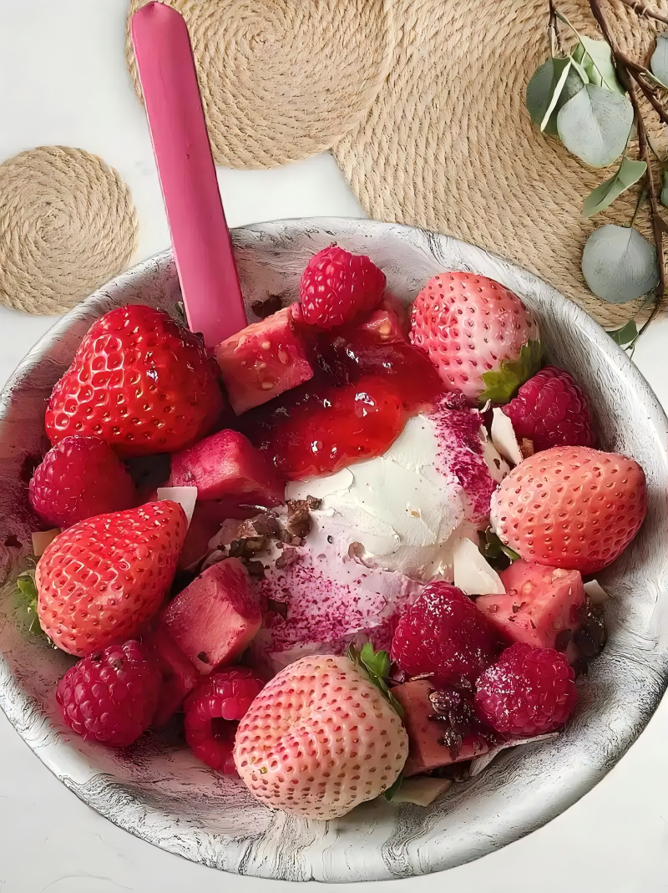
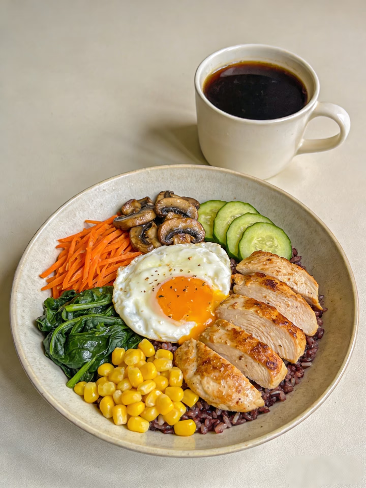

# NutriTrack Food Assistant

A cross-platform food nutrition tracking application built with .NET MAUI, helping users record and manage daily diet, view nutrition information, and enhance user experience through mobile device hardware capabilities.

[](https://classroom.github.com/a/uM_GSLJS)

## Application Screenshots

### Food Gallery
 | 
|---|---|

## Key Features

- Food Management: Browse, search, and add food and drink records
- Camera Capture: Take photos of food and preview
- Location Services: Record dining or purchase location
- Text-to-Speech: Read nutrition summaries aloud
- Haptic Feedback: Provide operation reminders with vibration and haptic feedback
- Theme Switching: Support dark/light themes and large font mode
- Accessibility: Semantic labels, screen reader announcements, and clear validation prompts

## Feature Details

| Feature | Description |
|------|------|
| Food List | Display food cards with search and pull-to-refresh |
| Detail Page | View nutrition information with speech and vibration support |
| Add Record | Form validation for required fields and value ranges |
| Hardware Demo | Camera, location, speech, vibration, and haptic feedback |
| Settings | Theme switching and large font mode |

## Technology Stack

- Framework: .NET MAUI (.NET 9)
- Platforms: Android 13+, Windows 10+
- Language: C# 12
- UI: XAML
- Data: REST API (mockapi.io) with local fallback

## Getting Started

### Environment Requirements

- Visual Studio 2022 (17.10+)
- .NET MAUI workload
- Android SDK (API 33+)

### Build Commands

```powershell
# Windows build
dotnet build .\FoodDrinkApp\FoodDrinkApp.csproj -f net9.0-windows10.0.19041.0

# Android build
dotnet build .\FoodDrinkApp\FoodDrinkApp.csproj -f net9.0-android

# Android run
dotnet build .\FoodDrinkApp\FoodDrinkApp.csproj -f net9.0-android -t:Run
```

### Data Configuration

The project supports fetching data from mockapi.io. To configure:

1. Create a `foods` resource at [mockapi.io](https://mockapi.io)
2. Update the API endpoint in `FoodDrinkApp/Services/MockApiConfig.cs`

For detailed configuration instructions, see: [mockapi配置说明.md](mockapi配置说明.md)

## Project Structure

```
FoodDrinkApp/
├── Pages/           # UI Pages
├── Services/        # Business Services
├── Models/          # Data Models
├── Platforms/       # Platform-specific Code
└── Resources/       # Resource Files (Images, Styles)
```

## Documentation

- [项目开发指南.md](项目开发指南.md) - Detailed development documentation
- [mockapi配置说明.md](mockapi配置说明.md) - API configuration guide

## License

MIT License
